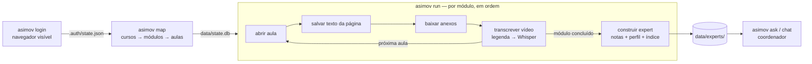

# Asimov Experts

Agente que **estuda os cursos da Asimov Academy na ordem cronológica** usando a sua conta,
baixa os materiais complementares e, **ao fim de cada módulo, cria um expert** naquele assunto.
Um **coordenador** recebe suas perguntas e consulta os experts certos, formando um
conselho de especialistas que cresce a cada módulo concluído.

> Este repositório era o app "Garagem Açaí". O código antigo continua no histórico do git
> (último commit dele: `0d1d50f`).

## Como funciona



"Assistir à aula" = obter a transcrição do vídeo: primeiro tenta legendas, senão
baixa só o áudio (temporário) e transcreve localmente com Whisper.

Detalhes de design em [docs/ARQUITETURA.md](docs/ARQUITETURA.md).

## Instalação

Rode **na sua máquina** (o login precisa de uma janela de navegador e o site usa Cloudflare).

```bash
python -m venv .venv && source .venv/bin/activate
pip install -e ".[whisper,dev]"
playwright install chromium
cp .env.example .env        # preencha ANTHROPIC_API_KEY (credenciais Asimov são opcionais)
```

Requer `ffmpeg` no PATH para o áudio (yt-dlp/Whisper).

## Rodar a noite toda (um comando)

```bash
asimov autopilot
```

Se não houver sessão salva, abre o navegador para você logar (1 minuto). Depois
segue sozinho: mapeia o catálogo, assiste às aulas em ordem, baixa anexos, cria um
expert por módulo, **funde os experts do mesmo tema** e grava `data/RELATORIO.md`.
Faz até 3 passadas para retentar aulas que falharam. Deixe o computador ligado
e sem hibernar (macOS: `caffeinate -i asimov autopilot`).

## Uso passo a passo

```bash
asimov login                 # abre o navegador; faça login (e o desafio do Cloudflare, se houver)
asimov inspect https://hub.asimov.academy/cursos   # salva HTML/print para calibrar seletores
asimov map                   # mapeia o catálogo em ordem
asimov run --limit-modules 1 # teste com 1 módulo
asimov run                   # roda tudo (retomável: pode parar e rodar de novo)
asimov status                # progresso
asimov fuse                  # reagrupa/funde experts por tema (--offline: sem Claude)
asimov experts               # lista o conselho
asimov ask "Como faço um dashboard com Streamlit lendo um CSV?"
asimov chat
```

### Primeira execução: calibrar seletores

Não há acesso à área logada durante o desenvolvimento, então os seletores CSS em
`config/settings.yaml` são genéricos. Depois do `login`, use `asimov inspect` na lista de
cursos, numa página de curso e numa aula, e ajuste `selectors.*` e `site.courses_url`
até o `asimov map` listar os módulos e aulas corretamente.

## Fusão de experts por tema

Depois de cada módulo, o Claude agrupa os experts de módulo por tema (ex.: "Pandas I" e
"Pandas II" → tema `pandas`). Cada tema com 2 ou mais módulos vira um **expert sênior**
(`data/experts/_themes/<tema>/`) com perfil consolidado e a união dos trechos de todos
os módulos. O coordenador passa a consultar o sênior no lugar dos experts de módulo.

- Temas já existentes são preservados: módulos novos entram neles ou criam temas novos.
- Só é refeita a fusão de um tema cuja lista de membros mudou.
- `asimov fuse --offline` agrupa por similaridade de termos, sem custo de API.

## Testes

```bash
pytest   # inclui um teste de ponta a ponta: site simulado + Chromium real + Claude simulado
```

## Estrutura

```
config/settings.yaml        URLs, seletores, pausas, modelo, Whisper
src/asimov_agent/
  cli.py                    comandos
  pipeline.py               fluxo cronológico e retomável
  storage.py                estado em SQLite (data/state.db)
  transcribe.py             legendas / Whisper
  llm.py                    cliente Claude
  scraper/                  login, catálogo, aula, anexos
  experts/                  construção, fusão por tema, registro, busca BM25, coordenador
data/ (ignorado no git)
  raw/<curso>/<módulo>/<aula>/   lesson.md, transcript.txt, attachments/, meta.json
  experts/<slug>/                profile.json, notes/, chunks.jsonl
  experts/_themes/<tema>/        experts sêniores (fusão) + themes.json
  RELATORIO.md                   progresso, conselho e erros
```

## Cuidados

- **Credenciais**: ficam só no `.env` e em `.auth/` (ambos no `.gitignore`). O agente não salva sua senha.
- **Conteúdo do curso é pago e para uso pessoal**: tudo que é baixado ou gerado fica em `data/`,
  fora do git. Não publique esse material nem os experts gerados a partir dele.
- **Termos de uso**: automação e download em massa podem violar os termos da plataforma.
  Confira os termos da Asimov Academy antes de rodar. O agente navega devagar (pausas
  aleatórias) e não tenta burlar proteções: o login é sempre feito por você.
- **Custo**: cada aula gera uma nota via Claude, e cada módulo gera um perfil. Teste com
  `--limit-modules 1` e acompanhe o uso da API.
